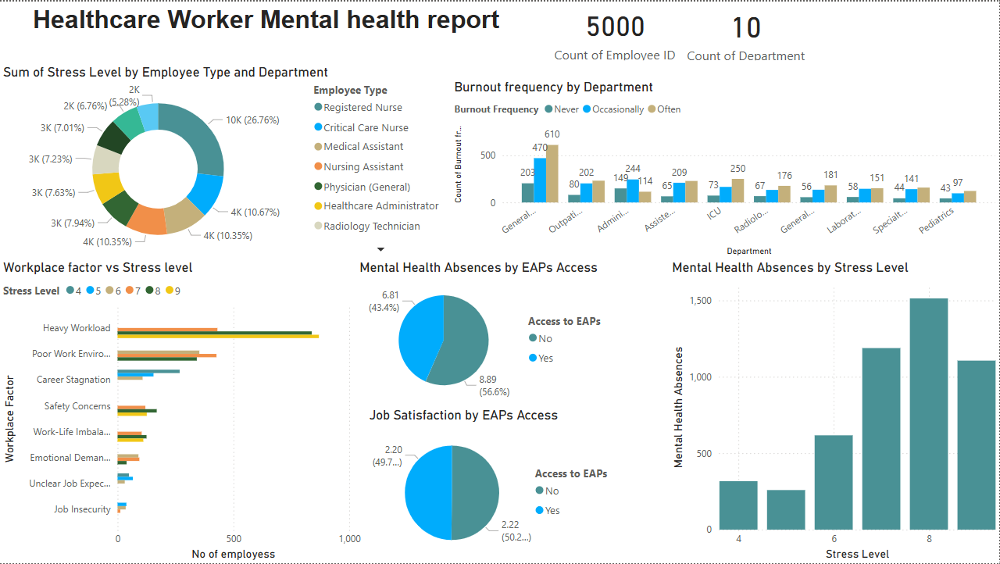

# 📊 Data Analytics Journey: From Reports to Real Impact  

## 🚀 Introduction  
When I first stepped into the **data analytics world**, my days were filled with **cleaning, transforming, and visualizing data**. I knew how to write **SQL queries, build Power BI dashboards, and automate reporting workflows**, yet something felt off. The numbers made sense, but the **business impact didn’t**.  

I was stuck in an **endless loop of reporting**, without truly understanding the **insights behind the data**. It felt like solving a **puzzle without knowing what the final picture should look like**.  

## 🔄 The Shift  
Then came the realization—**data isn't just about analysis; it's about impact**.  

### **📌 Key Questions Driving My Analytics Approach**  
- **What drives healthcare workforce decisions?** 🏥  
- **How do staffing shortages affect patient care?** 😕  
- **What story is this dataset telling me?** 📊  

I began **aligning business understanding with analytics**, **transforming dashboards into decision-making tools** instead of static reports.  

## 🏥 Healthcare Analytics & Workforce Strategy  
With this **mindset shift**, my excitement for **data storytelling, predictive modeling, and optimization strategies** skyrocketed—because now, **every dataset had a purpose**.  

### **🎯 My Current Focus:**  
✅ **Healthcare Analytics** – Leveraging **data engineering, visualization, and predictive modeling** to craft workforce strategies that improve efficiency and patient care.  
✅ **Decision-Driven Analytics** – Building models that **connect business understanding with technical insights** for real-world impact.  
✅ **ETL & Data Automation** – Streamlining workflows to optimize data accessibility and usability.  

## 💡 Lesson for Data Analysts  
📢 **Don’t just manipulate data—understand the business behind it.**  
That’s what makes an analyst **truly valuable**.  

🚀 **Let's connect!**  
📌 [LinkedIn](https://www.linkedin.com/in/astha-karki-580221172/) | 

##  Dashboard Preview
 
